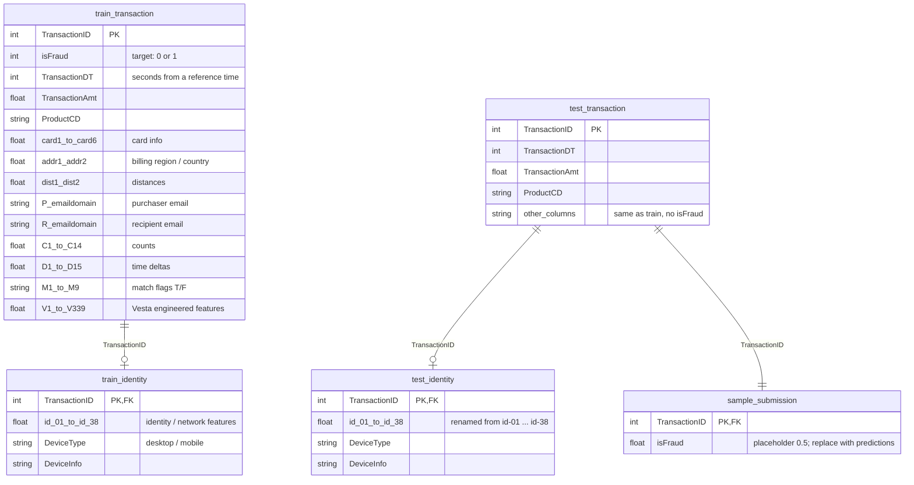

# fraud.db: Relational Map

SQLite database built by `data_extraction.py` from the Kaggle **IEEE-CIS Fraud Detection** competition data.

## Entity Relationship Diagram



## Relationships

| Parent | Child | Join key | Cardinality | Notes |
|---|---|---|---|---|
| `train_transaction` | `train_identity` | `TransactionID` | 1 to 0..1 | Only ~24% of transactions have identity data |
| `test_transaction` | `test_identity` | `TransactionID` | 1 to 0..1 | ~28% coverage |
| `test_transaction` | `sample_submission` | `TransactionID` | 1 to 1 | One prediction row per test transaction |

There is **no link between train and test tables**. They are separate splits by time, and test comes after train.

## Row Counts

| Table | Rows | Columns |
|---|---|---|
| `train_transaction` | 590,540 | 394 |
| `train_identity` | 144,233 | 41 |
| `test_transaction` | 506,691 | 393 |
| `test_identity` | 141,907 | 41 |
| `sample_submission` | 506,691 | 2 |

## Indexes

| Index | Table | Column |
|---|---|---|
| `idx_train_transaction_tid` | `train_transaction` | `TransactionID` |
| `idx_train_identity_tid` | `train_identity` | `TransactionID` |
| `idx_test_transaction_tid` | `test_transaction` | `TransactionID` |
| `idx_test_identity_tid` | `test_identity` | `TransactionID` |

## Important Notes

- **These relationships are not enforced.** The tables were created by `pandas.to_sql`, so there are no `PRIMARY KEY` or `FOREIGN KEY` constraints. The relationships above are how the data fits together, but SQLite won't stop bad data from being inserted.
- **Use `LEFT JOIN` for identity data.** An `INNER JOIN` would drop about 76% of transactions.

## Example Join

```sql
SELECT t.TransactionID,
       t.TransactionAmt,
       t.isFraud,
       i.DeviceType
FROM train_transaction AS t
LEFT JOIN train_identity AS i
       ON t.TransactionID = i.TransactionID;
```
